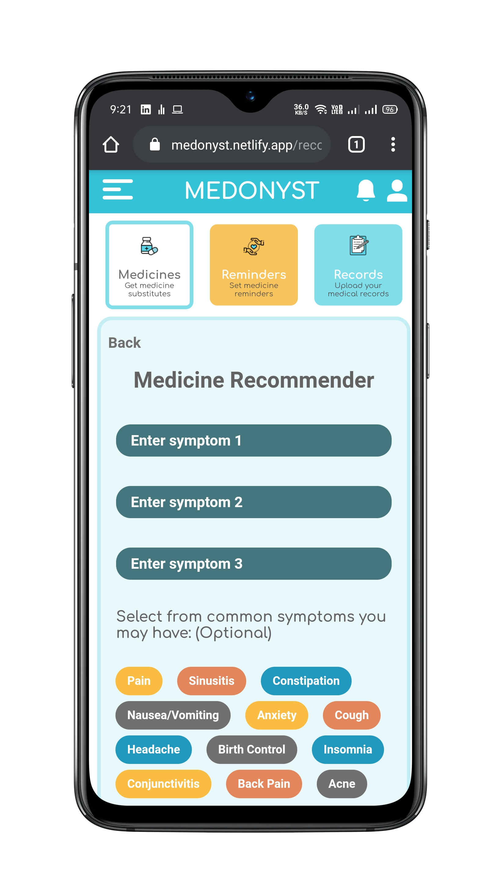
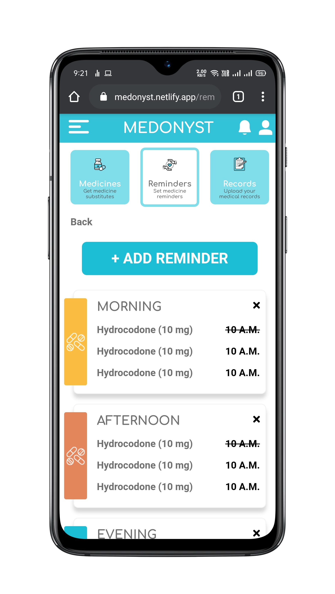

# Medonyst Web App (Frontend)

---

Medonyst is a Progressive Web App incorporating features such as an automated medicine prescription system, a medicine reminder system and a portal for storing medical records for future reference. This repository contains the frontend for the _Medonyst Web App_ built using modern web technologies.

